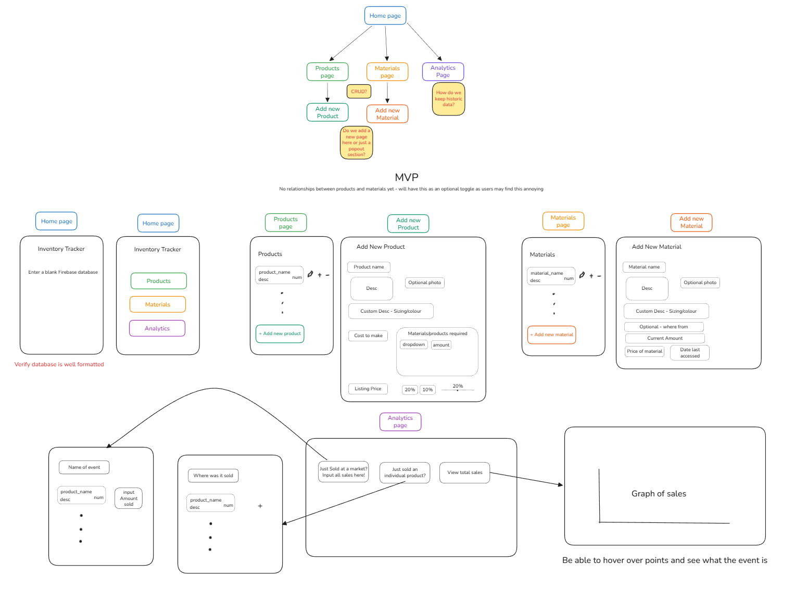

# inventory-tracker
A Plug-and-Play inventory tracker that utilises Google Firebase to track products sold and your inventory.

# Proposed features

A website for small business owners. Upon creating their own google firebase database, they can give their own database to our website. From this the user can add products, materials
- Add new product
	- add product picture
	- add custom parameters
		- sizing
		- colour
	- add materials required to make it
	- add cost required to make it
	- have an option to choose what price you choose to sell things at
- Add new material
	- add material picture
	- add source for where to get it
	- add a date last accessed and a price from that time
		- POTENTIALLY upon pressing a button it will scrape the website given for a new price and inform the user if it is on sale or more expensive
- Window where you can easily add and minus products
	- POTENTIALLY can we connect this to stripe? or like some POS system so that it also minuses it 
- window for a Store Sell
	- After a market you can add all products sold and it will save this data and give you it to analyse
	- if you've previously sold before we can compute metrics to show you
	- Sort products by most sold, 
